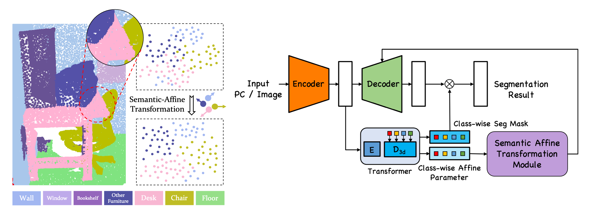

# SemAffiNet: Semantic-Affine Transformation for Point Cloud Segmentation
Created by [Ziyi Wang](https://wangzy22.github.io/), [Yongming Rao](https://raoyongming.github.io/), [Xumin Yu](https://yuxumin.github.io/), [Jie Zhou](https://scholar.google.com/citations?user=6a79aPwAAAAJ&hl=en&authuser=1), [Jiwen Lu](https://scholar.google.com/citations?user=TN8uDQoAAAAJ&hl=zh-CN)

This repository is an official implementation of SemAffiNet (CVPR 2022).



## Installation

### Prerequisites

- Python 3.8
- PyTorch 1.8.1
- MinkowskiEngine 0.5.4
- timm
- open3d
- cv2, tensorboardX, imageio, SharedArray, scipy, tqdm, h5py

```
conda create -n semaffinet python=3.8
conda activate semaffinet
conda install pytorch==1.8.1 torchvision==0.9.1 cudatoolkit=10.2

git clone https://github.com/NVIDIA/MinkowskiEngine.git
cd MinkowskiEngine
export CXX=g++-7
conda install openblas
python setup.py install --blas_include_dirs=${CONDA_PREFIX}/include --blas=openblas

pip install timm
pip install open3d
pip install opencv-python
conda install tensorboardX, imageio, sharedarray, plyfile, tqdm
```

## Usage

### Data Preparation

- Download the official [ScanNetV2](https://github.com/ScanNet/ScanNet) dataset.

- Prepare ScanNetV2 2D data:
    Please follow instructions in [3DMV](https://github.com/angeladai/3DMV/tree/master/prepare_data) repo.
    ```
    python prepare_2d_data.py --scannet_path SCANNET_INPUT_PATH --output_path SCANNET_OUTPUT_PATH --export_label_images
    ```

- Prepare ScanNetV2 3D data:
    ```
    python dataset/preprocess_3d_scannet.py
    ```

- Group ScanNetV2 2D views: preprocess 2D data and group multiple views of one scene into several groups.
 You will need to install `pointnet2_ops` from [PointNet++](https://github.com/erikwijmans/Pointnet2_PyTorch/tree/master/pointnet2_ops_lib) PyTorch repo to run the following command:
    ```
    python dataset/pregroup_2d_scannet.py
    ```
    You can also download our processed group results [here](https://drive.google.com/drive/folders/1qgOuSVjtH_gQZRobQ3p4iwesHDVV9nMu?usp=sharing). 

- The data is expected to be in the following file structure:
    ```
    SemAffiNet/
    |-- data/
        |-- 2D/
            |-- scene0000_00/
                |-- color/
                    |-- 0.jpg
                |-- depth/
                    |-- 0.jpg
                |-- label/
                    |-- 0.jpg
                |-- pose/
                    |-- 0.jpg
        |-- 3D/
            |-- train/
                |-- scene0000_00_vh_clean_2.pth
            |-- val/
                |-- scene0011_00_vh_clean_2.pth
            |-- test/
                |-- scene0707_00_vh_clean_2.pth
        |-- view_groups/
            |-- view_groups_train.pth
            |-- view_groups_val.pth
            |-- view_groups_test.pth
    ```
    
### Init model preparation
Download the pre-trained resnet34d [weights](https://github.com/rwightman/pytorch-image-models/releases/download/v0.1-weights/resnet34d_ra2-f8dcfcaf.pth) and place it in the `initmodel` folder. The pre-trained weight is from the `timm` repository.
### Train

- ScanNetV2 **5cm** voxelization setting:
    ```
    bash tool/train.sh SemAffiNet_5cm config/scannet/semaffinet_5cm.yaml scannet 2
    ```
- ScanNetV2 **2cm** voxelization setting:
    ```
    bash tool/train.sh SemAffiNet_2cm config/scannet/semaffinet_2cm.yaml scannet 2
    ```

### Test

- ScanNetV2 **5cm** voxelization setting:
    ```
    bash tool/test.sh SemAffiNet_5cm config/scannet/semaffinet_5cm.yaml scannet 2
    ```
- ScanNetV2 **2cm** voxelization setting:
    ```
    bash tool/test.sh SemAffiNet_2cm config/scannet/semaffinet_2cm.yaml scannet 2
    ```

## Results

We provide pre-trained SemAffiNet models:
| Dataset | URL | 3D mIoU | 2D mIoU |
| ------- | --- | ------- | ------- |
| ScanNetV2 5cm | [Google Drive](https://drive.google.com/file/d/16ghVzxbm05Sn4h8t7Ogr2LKJwqlZRgWI/view?usp=sharing)  | 72.1 | 68.2 |
| ScanNetV2 2cm | [Google Drive](https://drive.google.com/file/d/1rL_jVnJGRmGDcg4_0MRLug4s6qx0nF5O/view?usp=sharing)  | 74.5 | 74.2 |

Please rename the checkpoints as `model_best.pth.tar` and organize the directory as the following structure:
```
    SemAffiNet/
    |-- initmodel/
        |-- resnet34d_ra2-f8dcfcaf.pth
    |-- Exp/
        |-- scannet/
            |-- SemAffiNet_2cm/
                |-- model/
                    |-- model_best.pth.tar
            |-- SemAffiNet_5cm/
                |-- model/
                    |-- model_best.pth.tar
```

## Citation
If you find our work useful in your research, please consider citing: 
```
@inproceedings{wang2022semaff,
  title={SemAffiNet: Semantic-Affine Transformation for Point Cloud Segmentation},
  author={Wang, Ziyi and Rao, Yongming and Yu, Xumin and Zhou, Jie and Lu, Jiwen},
  booktitle={Proceedings of the IEEE Conference on Computer Vision and Pattern Recognition (CVPR)},
  year={2022}
}
```

## Acknowledgements

Our code is inspired by [BPNet](https://github.com/wbhu/BPNet). Some of the data preprocessing codes for ScanNetV2 are inspired by [3DMV](https://github.com/angeladai/3DMV/tree/master/prepare_data).
